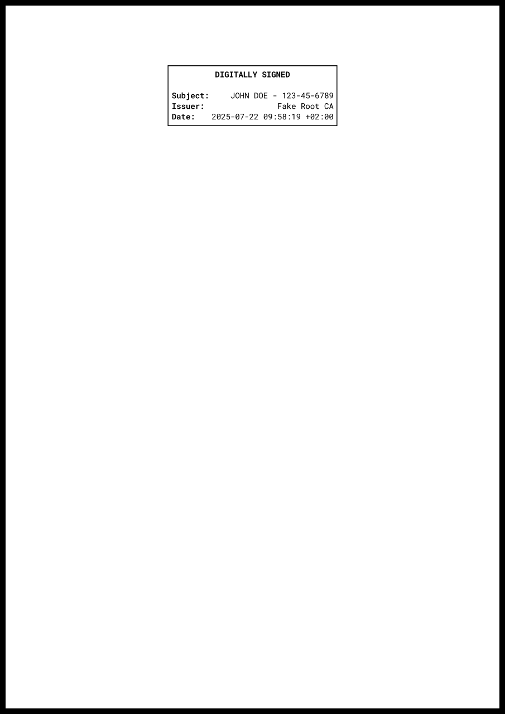
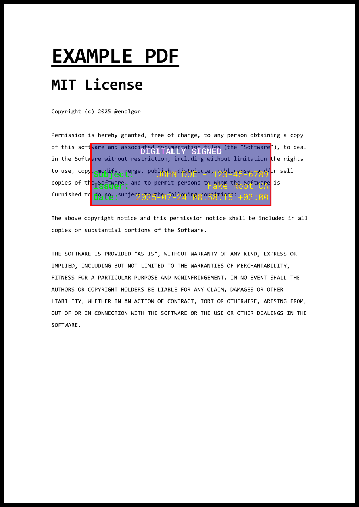
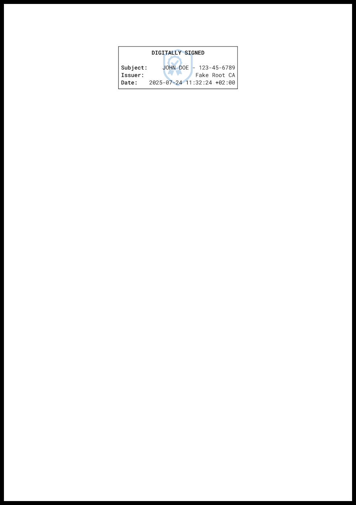

# 🚀 PDFSigner CLI

An easy-to-use command-line tool for signing a pdf with a pkcs12 certificate.

[Features](#-features) |
[Installation](#-installation) |
[Usage](#-usage) |
[Command Reference](#-command-reference) |
[Examples](#-examples)

## 📦 Features

  - 🔒 Supports pkcs12 certificates
  - 🔍 Add custom metadata in your signature
  - 🖌️ Create a highly customizable visual signature stamp
  - 🖼️ Add your own png logo or brand in the visual signature stamp


## 🛠 Installation

### Using Go

`go install github.com/enolgor/pdfsigner/cli/pdfsigner@latest`

### Manual installation

Download the binary from [releases](https://github.com/enolgor/pdfsigner/releases) and add it to your $PATH.

## 🚚 Usage

General command structure:

`pdfsigner [global options] [command [command options]] [<path to pdf file>]`

Print help:

`pdfsigner --help`

`pdfsigner [command] --help`

Print version:

`pdfsigner --version` or `pdfsigner -v`


## 📖 Command reference

All commands and options support shorthand aliases.

All options can also be configured using environment variables (shown with a `$` prefix), but **command-line flags always take precedence** over environment variables.

---

### 📄 PDF Commands

#### `page-count` or `pc`

Displays the number of pages in a PDF file.

**Usage examples:**

```sh
$ pdfsigner page-count <path-to-pdf>
#Output
12
```

```sh
$ pdfsigner pc <path-to-pdf>
#Output
12
```

---

#### `page-dim` or `pd`

Shows the dimensions (in points) of a specific page in a PDF file.

**Options:**

- `--page <int>`, `-p`, or `$PAGE` — Page number to inspect (1-based index). Defaults to `1`.

**Usage examples:**

```sh
$ pdfsigner page-dim -p 2 <path-to-pdf>
#Output (A4)
595 842
```

```sh
$ pdfsigner pd --page 3 <path-to-pdf>
#Output (Letter)
612 792
```

```sh
$ PAGE=1 pdfsigner pd <path-to-pdf>
#Output
303 157
```

### Signature commands

#### `sign` or `s`

Sign a pdf file using a pkcs12 certificate. Optionally create a visual stamp.

**Mandatory Options:**

- `--cert <path-to-cert>`, `-c` or `$CERT` - Path to the pkcs12 certificate file.

- `--passphrase <string>`, `-s` or `$PASSPHRASE` - Passphrase to decode the pkcs12 certificate.

**Options:**

- `--out <path-to-file>`, `-o` or `$OUT` - Path to write the signed pdf output. Defaults to `stdout`.

-  `--force`, `-f` or `$FORCE` - Force overwrite the signed pdf output.

- `--datetime <time>`, `-d` or `$DATETIME` - Date and time of the signature in RFC3339 format. Defaults to current date and time.

- `--location <string>`, `-l` or `$LOCATION` - Timezone string of the datetime. Defaults to `UTC`.

- `--signature-contact <string>`, `--sc` or `$SIGNATURE_CONTACT` - Contact details in the signature metadata.

- `--signature-location <string>`, `--sl` or `$SIGNATURE_LOCATION` - Location in the signature metadata.

- `--signature-name <string>`, `--sn` or `$SIGNATURE_NAME` - Signer name in the signature metadata.

- `--signature-reason <string>`, `--sr` or `$SIGNATURE_REASON` - Signature reason in the signature metadata.

- `--visible`, `-v` or `$VISIBLE` - Create a visible signature in the pdf.

- `--page <int>`, `-p` or `$PAGE` - Page of the pdf file where the visual signature will be placed (1-based index). Defaults to `1`.

- `--add-page`, `-a` or `$ADD_PAGE` - Add a page to the end of the pdf file where the visual signature will be placed (ignores `--page` flag if specified).

- `--page-size <string>`, `--ps` or `$PAGE_SIZE` - Page size of the added page to the end, either a common paper size name like `A4`, `Letter`, etc. or a `width,height` dimension in pts. Defaults to `A4`.

- `--dpi <float>`, `-i` or `$DPI` - DPI of the rendered signature stamp. Low values will make the signature appear pixeled. High values will increase the size of the signed pdf. Recommended value for print quality is around 300 dpi. Defaults to `300`.

- `--width <float>`, `-w` or `$WIDTH` - Specify width of the signature in pt. See note about
signature dimensions.[^1] Defaults to `200`.

- `--height <float>`, `-h` or `$HEIGHT` - Specify height of the signature in pt. See note about
signature dimensions.[^1] Defaults to `0`.

- `--xpos <float>`, `-x` or `$XPOS` - Specify the x position of the signature in pt. See note about signature placement.[^2] Defaults to `0`.

- `--ypos <float>`, `-y` or `$YPOS` - Specify the y position of the signature in pt. See note about signature placement.[^2] Defaults to `0`.

- `--rotate <rotation>`, `-r` or `$ROTATE` - Specify the rotation of the signature stamp. Only `0`, `90`, `180` or `270` are accepted. Defaults to `0`.

- `--no-title`, `--nt` or `$NOTITLE` - Do not add title line in the signature stamp. See note about signature stamp text content.[^3] (ignores any title related flag if specified).

- `--no-subject`, `--ns` or `$NOSUBJECT` - Do not add subject line in the signature stamp. See note about signature stamp text content.[^3] (ignores any subject related flag if specified).

- `--no-issuer`, `--ni` or `$NOISSUER` - Do not add issuer line in the signature stamp. See note about signature stamp text content.[^3] (ignores any issuer related flag if specified).

- `--no-date`, `--nd` or `$NODATE` - Do not add date line in the signature stamp. See note about signature stamp text content.[^3] (ignores any date related flag if specified, except date metadata).

- `--title <string>`, `-t` or `$TITLE` - Set signature stamp title text. Supports go templating syntax. See note about signature stamp text content.[^3] Defaults to "DIGITALLY SIGNED".

- `--subject-key <string>`, `--sk` or `$SUBJECTKEY` - Set the key of the subject line. See note about signature stamp text content.[^3] Defaults to `Subject:`.

- `--issuer-key <string>`, `--ik` or `$ISSUERKEY` - Set the key of the issuer line. See note about signature stamp text content.[^3] Defaults to `Issuer:`.

- `--date-key <string>`, `--dk` or `$DATEKEY` - Set the key of the date line. See note about signature stamp text content.[^3] Defaults to `Date:`.

- `--datetime-format <string>`, `--df` or `$DATETIMEFORMAT` - Specify the date and time in [golang datetime format](https://pkg.go.dev/time) to use in the date line (or templated value / title). See note about signature stamp text content.[^3]. Defaults to `2006-01-02 15:04:05 -07:00`.

- `--extra-lines <key,value>`, `--el` or `$EXTRALINES` - Add an extra line below the date line. Supports go templating syntax. Key can be omited. See note about signature stamp text content.[^3] This option can be used multiple times.

- `--no-empty-line-after-title`, `--nelt` or `$NOEMPTYLINEAFTERTITLE` - Do not add an empty line after the title line. See note about signature stamp text content.[^3]

- `--title-alignment <alignment>`, `--ta` or `$TITLEALIGNMENT` - Set the title alignment. Must be one of `left`, `center` or `right`. Defaults to `center`.

- `--key-alignment <alignment>`, `--ka` or `$KEYALIGNMENT` - Set the key column alignment. Must be one of `left`, `center` or `right`. Defaults to `left`.

- `--value-alignment <alignment>`, `--va` or `$VALUEALIGNMENT` - Set the value column alignment. Must be one of `left`, `center` or `right`. Defaults to `right`.

- `--line-alignment <alignment>`, `--lia` or `$LINEALIGNMENT` - Set the alignment for the entire lines. Must be one of `left`, `center` or `right`. If set to `left` or `right` it will override `--key-alignment` and `--value-alignment`. Defaults to `center`.

- `--logo <path-to-png>`, `-l` or `$LOGO` - Path to the png logo to be used, it will be drawn behind all text. Only png images are supported. The logo will be scaled (keeping aspect-ration) to fit the signature stamp.

- `--logo-grayscale`, `--lg` or `$LOGOGRAYSCALE` - Draw the logo in grayscale.

- `--logo-opacity <float>`, `--lo` or `$LOGOOPACITY` - Set the logo opacity. Must be between (incl.) `0` and `1`. Defaults to `0.25`.

- `--logo-alignment <alignment>`, `--la` or `$LOGOALIGNMENT` - Set the logo alignment. Must be one of `left`, `center` or `right`. Defaults to `center`.

- `--border-size <float>`, `--rs` or `$BORDERSIZE` - Set the border size in pts. Defaults to `1`.

- `--border-color <csscolor>`, `--rc` or `$BORDERCOLOR` - Set the border color. Any css color (named, hex, etc.) is supported. Defaults to `black`.

- `--background-color <csscolor>`, `--bc` or `$BACKGROUNDCOLOR` - Set the background color. Any css color (named, hex, etc.) is supported including `transparent`. Defaults to `white`.

- `--title-color <csscolor>`, `--tc` or `$TITLECOLOR` - Set the title text color. Any css color (named, hex, etc.) is supported. Defaults to `black`.

- `--key-color <csscolor>`, `--kc` or `$KEYCOLOR` - Set the key column text color. Any css color (named, hex, etc.) is supported. Defaults to `black`.

- `--value-color <csscolor>`, `--vc` or `$VALUECOLOR` - Set the value column text color. Any css color (named, hex, etc.) is supported. Defaults to `black`.

- `--load-font <path-to-font>`, `--lf`, or `$LOADFONT` — Load a custom ttf font. This option can be used multiple times. See [list-fonts command](#list-fonts) for more info about fonts.

- `--title-font <font-name>`, `--tf`, or `$TITLEFONT` - Font file name to use for the title text, without extension. Use [list-fonts command](#list-fonts) to see available fonts. Defaults to `RobotoMono-Bold`.

- `--key-font <font-name>`, `--kf`, or `$KEYFONT` - Font file name to use for the key column text, without extension. Use [list-fonts command](#list-fonts) to see available fonts. Defaults to `RobotoMono-SemiBold`.

- `--value-font <font-name>`, `--vf`, or `$VALUEFONT` - Font file name to use for the value column text, without extension. Use [list-fonts command](#list-fonts) to see available fonts. Defaults to `RobotoMono-Regular`.

---
[^1]: If only width or height is specified (recommended), the other dimension is calculated to fit the text
content properly. If both width and height are specified, the signature stamp might appear
distorted. You can use the `signature-dim` command in order to calculate the exact size in pts
of the signature stamp.

[^2]: If the position of the signature is not specified (neither xpos or ypos flag is set) and `--add-page` flag is set, the position will be auto calculated to display the signature stamp in the center-top part of the new page.

[^3]: The default behaviour of the signature stamp text (unless overriden) adds a title, empty line, subject line, issuer line and datetime line.
Extra lines can be added which will be appended sequentially below the datetime line. Each line below the title is separated into two columns: `key` and `value` (in order to ease formatting and alignment).
The value of subject and issuer are read from the certificate and can't be modified. The key of extra lines can be ommited, but the value is mandatory.
Title line and the `value` of each extra line admit [golang-style templates](https://pkg.go.dev/text/template), where `{{.Issuer}}`, `{{.Subject}}` and `{{.Date}}` (already formatted) variables are available.

**Usage examples:**

See [Examples](#-examples) section below.

---

#### `signature-dim` or `sd`

Calculate the signature dimensions (in pts) of a visual signature. Useful to calculate the correct placement of the signature stamp in a pdf.

**Options:**

A subset of options that can be used in the `sign` command are available (options that affect the signature dimensions). Please refer to [the `sign` command reference](#sign-or-s) for the details about the options:

- `--cert`
- `--passphrase`
- `--datetime`
- `--location`
- `--width`
- `--height`
- `--rotate`
- `--dpi`
- `--title`
- `--no-title`
- `--datetime-format`
- `--no-subject`
- `--no-issuer`
- `--no-date`
- `--subject-key`
- `--issuer-key`
- `--date-key`
- `--extra-lines`
- `--load-font`
- `--title-font`
- `--key-font`
- `--value-font`
- `--no-empty-line-after-title`

**Usage examples:**

```sh
$ pdfsigner signature-dim \
    --cert cert.p12 \
    --passphrase "bji&M7^#fpEBJAs53JXYf7!3v6MGTucT" \
    test.pdf
#Output
200 71.5765247410817
```

```sh
$ TITLE="Signed by {{.Subject}} on {{.Date}}. \
  Certificate issued by {{.Issuer}}."
  pdfsigner sd --cert cert.p12 \
    --passphrase "bji&M7^#fpEBJAs53JXYf7!3v6MGTucT" \
    --width 750 --rotate 270 \
    --datetime-format "02 Jan 2006 at 15:04:05" \
    --no-date --no-issuer --no-subject \
    --no-empty-line-after-title \
    test.pdf
#Output
27.224542242210088 750
```

---

#### `list-fonts`

List available fonts to be used in the visual signature. Roboto fonts with 3 variants (bold, regular, semibold) are embedded and always available. Custom ttf fonts can also be loaded. The output has the format `<name> (<source>)`.

**Options:**

- `--load-font <path-to-font>`, `--lf`, or `$LOADFONT` — Load a custom ttf font. This option can be used multiple times.

**Usage examples:**

```sh
$ pdfsigner list-fonts
#Output
RobotoMono-Bold (embedded)
RobotoMono-Regular (embedded)
RobotoMono-SemiBold (embedded)
Alef-Bold (system)
Alef-Regular (system)
...
```

```sh
$ pdfsigner list-fonts --load-font <path-to-font> --load-font <path-to-font-2>
#Output
RobotoMono-Bold (embedded)
RobotoMono-Regular (embedded)
RobotoMono-SemiBold (embedded)
FontName1 (custom)
FontName2 (custom)
Alef-Bold (system)
...
```

```sh
$ LOADFONT=<path-to-font> pdfsigner list-fonts
#Output
RobotoMono-Bold (embedded)
RobotoMono-Regular (embedded)
RobotoMono-SemiBold (embedded)
FontName1 (custom)
Alef-Bold (system)
...
```

---

## 📚 Examples

### Default signature stamp, added to last page

<table>
<tr>
<td>

```sh
$ pdfsigner sign \
    --cert cert.p12 \
    --passphrase "bji&M7^#fpEBJAs53JXYf7!3v6MGTucT" \
    --out output.pdf \
    --add-page \
    --force \
    --visible \
    test.pdf
```

</td>
<td>

  <a href="../../examples/default/output.pdf">
    
  </a>

</td>
</table>

### Side text single line, transparent background

<table>
<tr>
<td>

```sh
$ TITLE="Signed by {{.Subject}} on {{.Date}}. \
  Certificate issued by {{.Issuer}}."
  pdfsigner sign --cert cert.p12 \
    --passphrase "bji&M7^#fpEBJAs53JXYf7!3v6MGTucT" \
    --out output.pdf --page 1 --force --visible \
    --width 750 --rotate 270 --xpos 10 --ypos 50 \
    --datetime-format "02 Jan 2006 at 15:04:05" \
    --border-size 0 \
    --no-date --no-issuer --no-subject \
    --no-empty-line-after-title \
    --background-color "transparent" \
    --title-color "rgba(150, 150, 150, 130)" \
    test.pdf
```

</td>
<td>

  <a href="../../examples/sidetext/output.pdf">
    
  </a>

</td>
</table>

### Custom fonts

<table>
<tr>
<td>

```sh
$ pdfsigner sign --cert cert.p12 \
    --passphrase "bji&M7^#fpEBJAs53JXYf7!3v6MGTucT" \
    -o output.pdf -p 1 -f -v -w 300 -x 150 -y 225 \
    --rs 0 --nd --ni --nt --sk "Signed by: " \
    --bc "rgba(230,230,230,255)" \
    --lf fonts/Corinthia-Bold.ttf \
    --lf fonts/Corinthia-Regular.ttf \
    --kf "Corinthia-Bold" --vf "Corinthia-Regular" \
    test.pdf
```

</td>
<td>

  <a href="../../examples/customfonts/output.pdf">
    
  </a>

</td>
</table>

### Colors

<table>
<tr>
<td>

```sh
$ pdfsigner sign --cert cert.p12 \
    --passphrase "bji&M7^#fpEBJAs53JXYf7!3v6MGTucT" \
    -o output.pdf -p 1 -f -v \
    -w 300 -x 150 -y 500 --rs 2 \
    --rc "rgba(255,0,0,255)" \
    --bc "rgba(0,255,125,125)" \
    --tc "rgba(255,255,255,255)" \
    --kc "rgba(0,255,0,255)" \
    --vc "rgba(255,255,0,255)" \
    test.pdf
```

</td>
<td>

  <a href="../../examples/colors/output.pdf">
    
  </a>

</td>
</table>

### With logo, added to last page

<table>
<tr>
<td>

```sh
$ pdfsigner sign --cert cert.p12 \
    --passphrase "bji&M7^#fpEBJAs53JXYf7!3v6MGTucT" \
    -o output.pdf --add-page -f -v \
    --logo logo.png \
    test.pdf
```

</td>
<td>

  <a href="../../examples/logo/output.pdf">
    
  </a>

</td>
</table>

----
This project is licensed under the MIT License.  
It includes third-party packages under MIT, BSD, FreeType and Apache licenses.  
See [THIRD_PARTY_LICENSES](./THIRD_PARTY_LICENSES.md) for details.